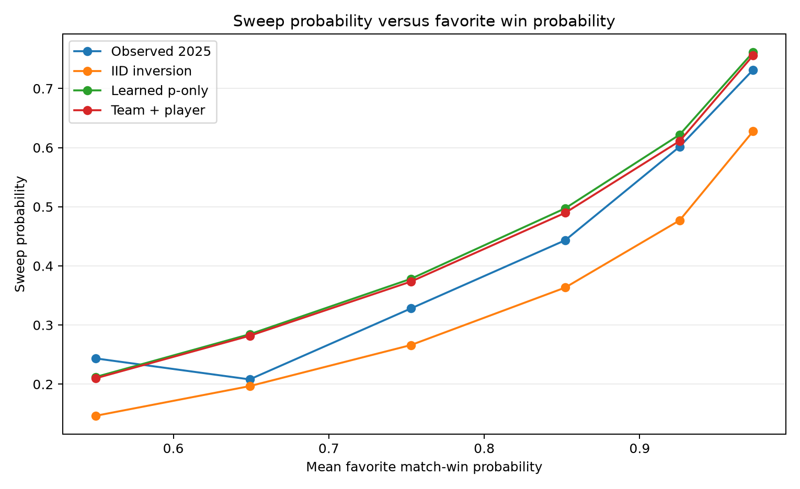
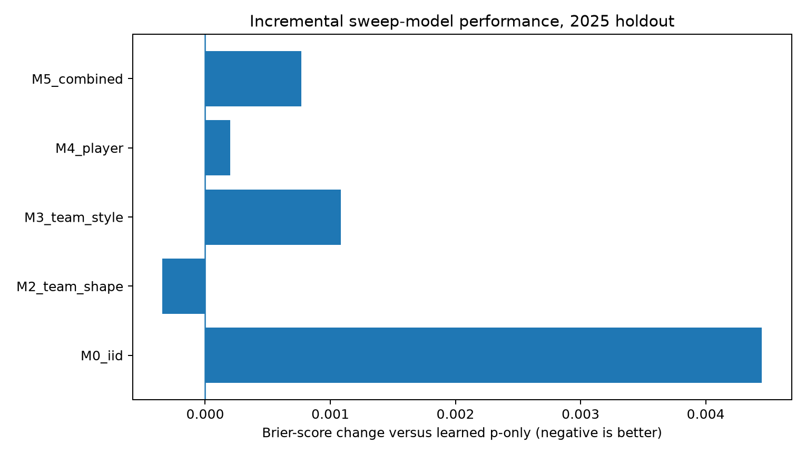
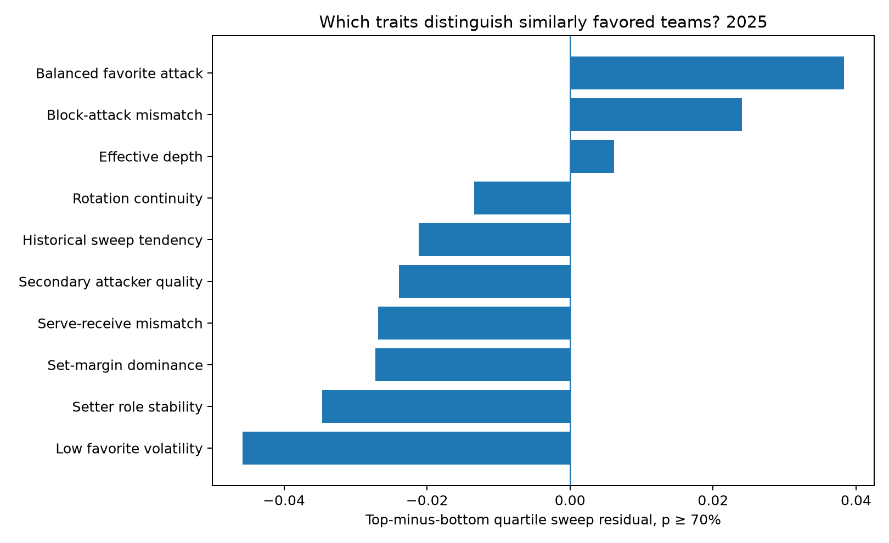

# NCAA Division I Women’s Volleyball Sweep Projection — 2023–2025

## Executive Summary

- **Overall win probability is the dominant sweep predictor, but it is not sufficient.** The empirical sweep rate rises sharply across favorite-probability bands. The IID set model is a coherent starting curve; a learned probability-only model corrects departures from identical, independent sets.
- **The best 2025 model by Brier score was Win probability + set-shape history.** Its Brier change versus the learned p-only model was -0.00034; its log-loss change was -0.00058. The best model among favorites at 70% or higher was Win probability + set-shape history.
- **Use a hurdle model:** retain the locked match-win probability, then estimate `P(3–0 | win)` from residual set-shape, matchup, and player-composition features. Multiply the two probabilities so a sweep can never be more likely than a win.
- **Player statistics should enter as projected rotation attributes, not raw season totals.** The most defensible features are role-weighted attack efficiency/error control, secondary-option quality, setter concentration, blocking/serving pressure, reception vulnerability, depth, and continuity.

## Data and Validation Design

The analysis used 29,608 team-match rows and 184,921 filtered player-match rows from 2023–2025, paired into 14,273 unique matches. Every feature was frozen before the target date; same-day matches used a common start-of-day snapshot. The tests were forward-looking: 2023 trained 2024, and 2023–2024 trained the final 2025 holdout.

The hierarchy was IID inversion; learned p-only curve; p plus set shape; p plus team style/matchups; p plus player composition; and a combined model.

## Winning and Sweeping Are Related Nonlinearly

Under a constant IID set-win probability `q`, match-win probability is `10q³ − 15q⁴ + 6q⁵`, and sweep probability is `q³`.

| Match-win P | Implied set-win P | Sweep P | Sweep given win |
|---:|---:|---:|---:|
| 55% | 52.7% | 14.6% | 26.6% |
| 60% | 55.4% | 17.0% | 28.3% |
| 70% | 61.0% | 22.7% | 32.5% |
| 80% | 67.3% | 30.5% | 38.2% |
| 85% | 71.0% | 35.8% | 42.1% |
| 90% | 75.3% | 42.8% | 47.5% |
| 95% | 81.1% | 53.3% | 56.1% |
| 99% | 89.4% | 71.5% | 72.3% |

Two teams with the same match-win probability have the same sweep probability under the IID model. Useful differentiation therefore must come from set-to-set variance, style, matchup, or lineup structure not already encoded in the win probability.

## Empirical 2025 Sweep Curve

| Favorite band | N | Mean win P | Actual win | Actual sweep | Sweep given win | IID | P-only | Combined |
|---|---:|---:|---:|---:|---:|---:|---:|---:|
| 50–60% | 665 | 55.0% | 56.8% | 24.4% | 42.9% | 14.7% | 21.2% | 21.0% |
| 60–70% | 692 | 64.9% | 62.4% | 20.8% | 33.3% | 19.7% | 28.4% | 28.2% |
| 70–80% | 689 | 75.3% | 72.9% | 32.8% | 45.0% | 26.6% | 37.8% | 37.3% |
| 80–90% | 803 | 85.2% | 83.3% | 44.3% | 53.2% | 36.3% | 49.7% | 49.0% |
| 90–95% | 492 | 92.6% | 92.3% | 60.2% | 65.2% | 47.7% | 62.2% | 61.1% |
| 95–100% | 484 | 97.3% | 96.3% | 73.1% | 76.0% | 62.7% | 76.1% | 75.6% |

Sweep probability is primarily a nonlinear transformation of match strength. The second stage should estimate only the residual shape of the score distribution.

## 2025 Out-of-Time Model Comparison

### All matches

| Model | N | Actual sweep | Mean forecast | Brier | Log loss | ECE10 | AUC |
|---|---:|---:|---:|---:|---:|---:|---:|
| IID inversion | 3,825 | 40.2% | 32.6% | 0.21537 | 0.62302 | 0.0761 | 0.7023 |
| Learned win-probability curve | 3,825 | 40.2% | 43.7% | 0.21092 | 0.61159 | 0.0377 | 0.7023 |
| Win probability + set-shape history | 3,825 | 40.2% | 43.4% | 0.21058 | 0.61101 | 0.0385 | 0.7027 |
| Win probability + team style/matchups | 3,825 | 40.2% | 43.4% | 0.21200 | 0.61433 | 0.0407 | 0.6982 |
| Win probability + player composition | 3,825 | 40.2% | 43.5% | 0.21112 | 0.61197 | 0.0343 | 0.7013 |
| Combined team + player model | 3,825 | 40.2% | 43.2% | 0.21168 | 0.61357 | 0.0394 | 0.6987 |

### Favorites of at least 70%

| Model | N | Actual sweep | Mean forecast | Brier | Log loss | ECE10 |
|---|---:|---:|---:|---:|---:|---:|
| IID inversion | 2,468 | 49.9% | 41.1% | 0.23526 | 0.66342 | 0.0885 |
| Learned win-probability curve | 2,468 | 49.9% | 54.1% | 0.22894 | 0.64946 | 0.0451 |
| Win probability + set-shape history | 2,468 | 49.9% | 53.7% | 0.22826 | 0.64812 | 0.0390 |
| Win probability + team style/matchups | 2,468 | 49.9% | 53.7% | 0.23035 | 0.65288 | 0.0406 |
| Win probability + player composition | 2,468 | 49.9% | 53.8% | 0.22917 | 0.64996 | 0.0408 |
| Combined team + player model | 2,468 | 49.9% | 53.4% | 0.22974 | 0.65152 | 0.0426 |

## Hypotheses Distinguishing Similarly Favored Teams

The odds ratio controls for the nonlinear win-probability curve among favorite wins in the 2024 validation data, with date-clustered uncertainty. The 2025 residual lift compares top and bottom feature quartiles within narrow probability bands among favorites of at least 70%.

| Hypothesis | Standardized OR | 95% CI | Cluster p | 2025 Δ Brier | High-favorite residual lift | Lift 95% CI |
|---|---:|---:|---:|---:|---:|---:|
| Historical sweep tendency | 1.01 | 0.93–1.08 | 0.854 | +0.00060 | -2.1% | -6.8% to 2.5% |
| Set-margin dominance | 1.00 | 0.90–1.11 | 0.994 | +0.00062 | -2.7% | -9.1% to 4.0% |
| Low favorite volatility | 0.95 | 0.89–1.02 | 0.170 | +0.00043 | -4.6% | -10.9% to 1.6% |
| Serve-receive mismatch | 1.04 | 0.96–1.12 | 0.317 | +0.00068 | -2.7% | -7.9% to 2.9% |
| Block-attack mismatch | 0.94 | 0.88–1.02 | 0.126 | +0.00085 | 2.4% | -2.9% to 8.1% |
| Balanced favorite attack | 0.97 | 0.90–1.04 | 0.367 | +0.00082 | 3.8% | -0.2% to 8.2% |
| Secondary attacker quality | 1.03 | 0.95–1.11 | 0.531 | +0.00073 | -2.4% | -7.1% to 2.4% |
| Setter role stability | 1.05 | 0.97–1.13 | 0.201 | +0.00079 | -3.5% | -8.8% to 1.6% |
| Rotation continuity | 1.02 | 0.94–1.10 | 0.623 | +0.00067 | -1.3% | -5.6% to 3.6% |
| Effective depth | 1.02 | 0.94–1.10 | 0.690 | +0.00066 | 0.6% | -4.3% to 5.7% |

### Interpretation

- **Set dominance and volatility:** consistent set-margin superiority and fewer five-set matches should increase conditional sweep probability relative to equally likely but volatile favorites.
- **Serve-receive mismatch:** ace pressure against an error-prone receiving unit can create repeated scoring runs and prevent the underdog from stealing a set.
- **Block-attack mismatch:** strong blocking against a high-error attack reduces the underdog’s set-winning paths. Middle/block availability may therefore matter more for sweep shape than generic roster continuity.
- **Attack balance:** concentration can help when the star is dominant, but can lower the floor if one rotation or matchup suppresses that player. It should be nonlinear and paired with secondary-option quality.
- **Setter stability:** setter share and continuity are preferable to raw assists per set because they better represent role stability.
- **Depth:** depth can sustain efficiency through substitutions, but an unsettled deep rotation may instead indicate uncertainty; the relationship need not be monotonic.

## Recommended Production Architecture

Use the locked match-win model unchanged and attach a shadow conditional sweep head:

`P(favorite sweep) = P(favorite wins) × P(3–0 | favorite wins, residual features)`

Use regularization and a p-only offset. Inputs should include calibrated match-win probability; set dominance/volatility; hitting and attack-error control; serve-receive and block-attack mismatches; projected player attack shares and efficiencies; secondary-option quality; setter share; middle/block contribution; passing load; depth; continuity; verified availability; venue/travel/rest; and early-season uncertainty.

After estimating sweep probability, distribute the remaining favorite-win mass between 3–1 and 3–2 with a constrained conditional model. The six exact-score probabilities must sum to one, and the three favorite-win scores must sum exactly to the locked match-win probability.

## Promotion Standard

Keep this head shadow-only until prospectively frozen predictions improve sweep Brier and log loss over IID and learned p-only baselines, preserve calibration in each high-favorite band, improve six-class exact-score scoring and expected-sets MAE, remain stable across season phases and venues, and pass player-availability timing audits.

## Caveats

- Player box scores show participation, not the reason for absence; verified status remains necessary.
- Box scores do not directly measure rotation-level sideout efficiency. Rally play-by-play would improve serve/receive, sideout, breakpoint, and variance features.
- Projected rotation attributes are prior-participation priors, not confirmed lineups.
- Associations are predictive, not causal.

## Bottom Line

**Start with match-win probability, but do not stop there.** The sweep head should model whether the favorite can avoid one bad set. The leading residual candidates are consistent set dominance, low volatility, favorable serve-receive and block-attack matchups, and a stable rotation with multiple efficient scoring options. Player features belong in score-shape modeling even though broad roster features did not justify changing the match-winner model.